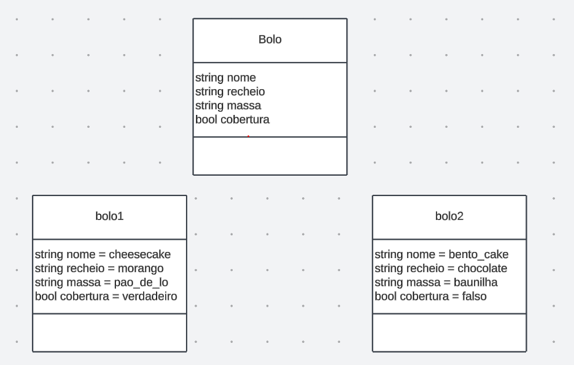

# Exemplos em python

1) Crie uma classe bolo
2) Crie uma instância da classe bolo
3) Crie dois tipos de bolo com os seguintes atributos:
- nome
- recheio
- massa
- se tem cobertura - o primeiro tem, o segundo não
4) Crie um terceiro bolo, igual ao primeiro, mas sem cobertura:
- advindo da instância principal
- Advindo de um objeto já criado.



```
class Bolo:
    pass

bolo1 = Bolo()
bolo1.nome = 'chessecake'
bolo1.recheio = 'morango'
bolo1.massa = 'pao_de_lo'
bolo1.cobertura = True

bolo2 = Bolo()
bolo2.nome = 'bento_cake'
bolo2.recheio = 'chocolate'
bolo2.massa = 'baunilha'
bolo2.cobertura = False

#bolo3 = Bolo()
#bolo3.cobertura = False

bolo3 = bolo1
bolo3.cobertura = False
```
---
### Com construtor:
```
class Bolo:
    def __init__(self,nome,recheio,massa,cobertura):
        self.nome = nome
        self.recheio = recheio
        self.massa = massa
        self.cobertura = cobertura

bolo1 = Bolo('chessecake','morango','pao_de_lo',True)

bolo2 = Bolo('bento_cake','chocolate','baunilha',False)

#dessa forma dará errado com o construtor
#bolo3 = Bolo()
#bolo3.cobertura = False

bolo3 = bolo1
bolo3.cobertura = False
```
## Segundo exercício
```
#class Carro:
#    def __init__(self,modelo,ano,cor,arcondicionado):
#        self.modelo = modelo
#        self.ano = ano
#        self.cor = cor
#        self.arcondicionado = True
        
class Carro:
   def __init__(self,modelo,ano,cor,arcondicionado):
       self.modelo = modelo
       self.ano = ano
       self.cor = cor
       self.arcondicionado = arcondicionado    

carro1 = Carro('brasilia',1999,'amarela',True)
carro2 = Carro('fusca', 2009, 'preto', False)

#Criando o 3 carro na versao 1
#carro3 = Carro('uno',1999, 'preto', False)

#Criando o 3 carro na versao 2
carro3 = carro1
carro3.arcondicionado = False

print(carro1.arcondicionado,carro2.arcondicionado,carro3.arcondicionado)
print(carro1.modelo,carro2.modelo,carro3.modelo)
```